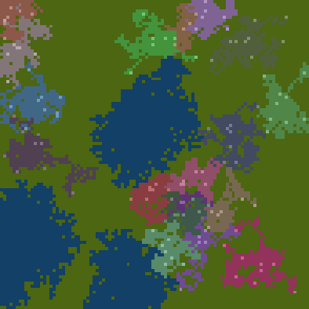
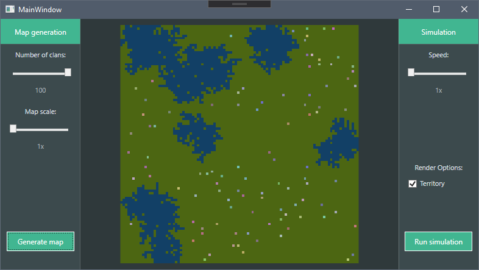

# Game of Life - Clans
> Simple simulation about surviving and conquering other clans.

## Table of contents
* [Demo](#demo)
* [General info](#general-info)
* [Screenshots](#screenshots)
* [Features](#features)
* [Unit types in simulation](#units-types-in-simulation)
* [Status](#status)

## Demo

## General info
* Main goal of this app is to simulate fighting clans. 
* Each clan has its own headquarter where units creation occurs. 
* Each unit moves around on the map conquering terrain and interacting with other units.
* Simulation ends if there is only one clan left.

## Screenshots

## Features
* Number of conquered territory affects all units strength and defence.
* Type of terrain affect strength and defence.
* Terrain generator.
* Selectable map scale.
* Customizable number of clans on map.
* Up to 100 diferent clans in simulation.
* Changable simulation speed.

To-do list:
* Code refactoring
* Implement more tests
* Implement better terrain generator (mountains, sand)

## Units types in simulation
* Headquarter - Heart of clan, if destroyed clan is vanished. Creates Soldiers and Builders.
* Soldier - Moves, attacks enemies, conquers new terrain.
* Builder - Moves, if far enought from headquarter, can transform into Outpost.
* Outpost - Creates Soldiers at slower rate, heals wounded allies nearby.

## Status
Project is: _in progress_
